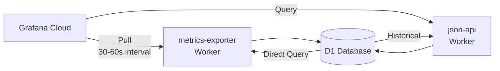

# Grafana Cloud統合 - 要求仕様

## 概要

収集した環境データ（気象データ、SwitchBotセンサーデータ）をGrafana Cloudで可視化するための統合機能を実装する。

## 背景と目的

### 背景
- Cloudflare D1に蓄積された時系列データを効果的に可視化する必要がある
- 保育施設の環境管理において、リアルタイムでの監視と履歴分析が重要
- Grafana Cloudの無料枠（10,000シリーズ、14日間保持）で十分な要件を満たせる

### 目的
- 環境データのリアルタイム監視
- 過去データの傾向分析
- 異常値の早期発見とアラート

## 機能要件

### 1. データ取得API

#### メトリクスエンドポイント
- Prometheus形式でメトリクスをエクスポート
- 認証機能（Bearer Token）
- レート制限（1分あたり60リクエスト）

#### 提供メトリクス
- `childcare_temperature_celsius`: 温度（摂氏）
- `childcare_humidity_percent`: 湿度（％）
- `childcare_pressure_hpa`: 気圧（hPa）
- `childcare_wind_speed_ms`: 風速（m/s）
- `childcare_visibility_meters`: 視程（m）
- `childcare_cloudiness_percent`: 雲量（％）

各メトリクスには以下のラベルを付与：
- `location`: 場所（例：takamatsu）
- `source`: データソース（weather_api, switchbot）
- `device_id`: デバイスID（SwitchBotの場合）

### 2. JSON API（Grafana JSON Datasource用）

#### エンドポイント
- `/` - ヘルスチェック
- `/search` - 利用可能なメトリクスのリスト
- `/query` - 時系列データのクエリ
- `/annotations` - アノテーション（イベント）データ

#### レスポンス形式
```json
{
  "target": "temperature",
  "datapoints": [
    [value, timestamp],
    [value, timestamp]
  ]
}
```

### 3. データ集計

#### リアルタイムデータ
- 最新値の取得（KVキャッシュから）
- 過去24時間の生データ

#### 集計データ
- 時間ごとの平均値
- 日ごとの最小/最大/平均値
- 週ごとの統計

## 非機能要件

### パフォーマンス
- レスポンス時間: 95パーセンタイルで100ms以内（D1直接クエリで十分高速）
- アクセス頻度: < 1 RPS（Grafanaスクレイピング間隔30-60秒）
- 同時接続数: 最大10

### セキュリティ
- API認証（Bearer Token または API Key）
- HTTPS必須
- CORS設定（Grafana Cloudからのアクセスのみ許可）

### 可用性
- Cloudflare Workersの可用性に準拠（99.9%）
- エラー時のグレースフルな劣化

## 制約事項

### Grafana Cloud無料枠の制限
- メトリクス数: 10,000シリーズまで
- データ保持期間: 14日間
- ユーザー数: 3名まで

### Cloudflare Workers制限
- CPU時間: 10ms（無料枠）
- メモリ: 128MB
- リクエストサイズ: 100KB

## 実装方針

### アーキテクチャ


### 技術選択
- **Prometheus形式エクスポート**: Grafana Cloudの標準的な取り込み方式
- **JSON Datasource**: 柔軟なクエリとカスタムビジュアライゼーション
- **D1ダイレクトクエリ**: 低頻度アクセス（< 1 RPS）のためキャッシュ不要

## 成功基準

1. Grafana Cloudダッシュボードでリアルタイムデータが表示される
2. 過去30日間のデータトレンドが確認できる
3. 温度・湿度の異常値でアラートが発火する
4. レスポンス時間が1秒以内

## 今後の拡張

- Grafana Lokiとの連携によるログ可視化
- Grafana OnCallとの連携によるインシデント管理
- カスタムパネルプラグインの開発