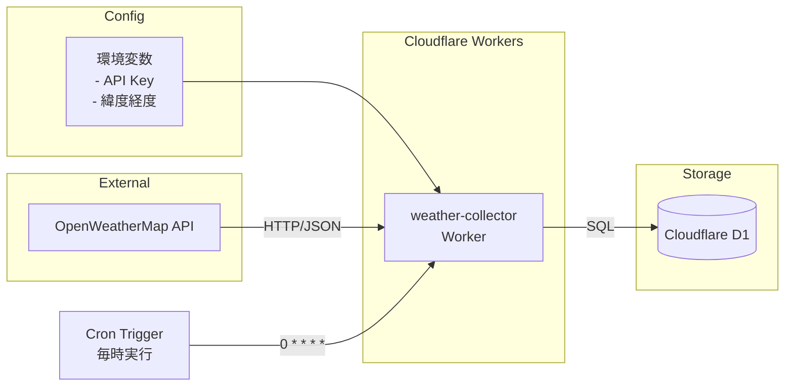

# OpenWeatherMap API統合 - 設計

## 1. アーキテクチャ概要



## 2. モジュール構成

```
workers/weather-collector/
├── src/
│   ├── index.ts           # Workerエントリーポイント
│   ├── handler.ts         # メインロジック
│   └── handler.test.ts    # ハンドラーテスト
└── wrangler.toml          # Worker設定

shared/
├── api-clients/
│   ├── openweather.ts     # APIクライアント
│   └── openweather.test.ts # クライアントテスト
├── db/
│   ├── weather-queries.ts # 気象データクエリ
│   └── weather-queries.test.ts
└── types/
    ├── weather.ts         # 気象データ型
    └── result.ts          # Result型
```

## 3. 詳細設計

### 3.1 Workerエントリーポイント

```typescript
// workers/weather-collector/src/index.ts
import type { Env } from "./types.ts";
import { collectWeatherData } from "./handler.ts";

export default {
  async scheduled(
    controller: ScheduledController,
    env: Env,
    ctx: ExecutionContext,
  ): Promise<void> {
    try {
      await collectWeatherData(env);
      console.log("Weather data collection completed successfully");
    } catch (error) {
      console.error("Weather data collection failed:", error);
      throw error; // Cloudflareに失敗を通知
    }
  },

  // デバッグ用の手動実行エンドポイント
  async fetch(
    request: Request,
    env: Env,
    ctx: ExecutionContext,
  ): Promise<Response> {
    if (request.method !== "POST") {
      return new Response("Method not allowed", { status: 405 });
    }

    try {
      await collectWeatherData(env);
      return new Response("Weather data collected successfully", { status: 200 });
    } catch (error) {
      return new Response(`Error: ${error.message}`, { status: 500 });
    }
  },
};
```

### 3.2 メインハンドラー

```typescript
// workers/weather-collector/src/handler.ts
import { fetchWeatherData } from "@shared/api-clients/openweather.ts";
import { insertWeatherData } from "@shared/db/weather-queries.ts";
import type { Env } from "./types.ts";
import type { WeatherData } from "@shared/types/weather.ts";

export const collectWeatherData = async (env: Env): Promise<void> => {
  // 1. 設定値の取得とバリデーション
  const config = getWeatherConfig(env);

  // 2. APIからデータ取得
  const apiResponse = await fetchWeatherData({
    apiKey: env.OPENWEATHER_API_KEY,
    latitude: config.latitude,
    longitude: config.longitude,
  });

  // 3. データ変換
  const weatherData = transformToWeatherData(apiResponse, config);

  // 4. データベースに保存
  const result = await insertWeatherData(env.DB, weatherData);

  if (!result.ok) {
    throw new Error(`Failed to save weather data: ${result.error.message}`);
  }
};

const getWeatherConfig = (env: Env) => {
  const latitude = parseFloat(env.WEATHER_LATITUDE);
  const longitude = parseFloat(env.WEATHER_LONGITUDE);

  if (isNaN(latitude) || isNaN(longitude)) {
    throw new Error("Invalid latitude or longitude configuration");
  }

  return {
    latitude,
    longitude,
  };
};

const transformToWeatherData = (
  response: OpenWeatherResponse,
  config: WeatherConfig,
): WeatherData => {
  return {
    timestamp: response.dt * 1000, // Unix timestamp to milliseconds
    latitude: config.latitude,
    longitude: config.longitude,
    temperature: response.main.temp,
    feelsLike: response.main.feels_like,
    tempMin: response.main.temp_min,
    tempMax: response.main.temp_max,
    humidity: response.main.humidity,
    pressure: response.main.pressure,
    windSpeed: response.wind.speed,
    windDeg: response.wind.deg,
    weatherMain: response.weather[0]?.main || "Unknown",
    weatherDescription: response.weather[0]?.description || "",
    visibility: response.visibility,
    sunrise: response.sys.sunrise * 1000,
    sunset: response.sys.sunset * 1000,
  };
};
```

### 3.3 APIクライアント

```typescript
// shared/api-clients/openweather.ts
import type { Result } from "@shared/types/result.ts";
import type { OpenWeatherResponse } from "@shared/types/weather.ts";

interface FetchWeatherParams {
  apiKey: string;
  latitude: number;
  longitude: number;
}

export const fetchWeather = async (
  params: FetchWeatherParams,
): Promise<OpenWeatherResponse> => {
  const url = buildWeatherApiUrl(params);

  const response = await fetchWithRetry(url, {
    maxRetries: 3,
    retryDelay: 1000,
  });

  if (!response.ok) {
    throw new Error(`API request failed: ${response.status} ${response.statusText}`);
  }

  const data = await response.json();

  if (!validateApiResponse(data)) {
    throw new Error("Invalid API response format");
  }

  return data as OpenWeatherResponse;
};

const buildWeatherApiUrl = (params: FetchWeatherParams): string => {
  const baseUrl = "https://api.openweathermap.org/data/2.5/weather";
  const searchParams = new URLSearchParams({
    lat: params.latitude.toString(),
    lon: params.longitude.toString(),
    appid: params.apiKey,
    units: "metric",
    lang: "ja",
  });

  return `${baseUrl}?${searchParams.toString()}`;
};

const fetch = async (
  url: string,
  options: { maxRetries: number; retryDelay: number },
): Promise<Response> => {
  let lastError: Error | null = null;

  for (let i = 0; i <= options.maxRetries; i++) {
    try {
      const response = await fetch(url, {
        signal: AbortSignal.timeout(5000), // 5秒タイムアウト
      });

      if (response.ok || response.status < 500) {
        return response; // 成功または4xxエラーはリトライしない
      }

      lastError = new Error(`HTTP ${response.status}`);
    } catch (error) {
      lastError = error as Error;
    }

    if (i < options.maxRetries) {
      // 指数バックオフ
      const delay = options.retryDelay * Math.pow(2, i);
      await new Promise(resolve => setTimeout(resolve, delay));
    }
  }

  throw lastError || new Error("Request failed");
};

const validateApiResponse = (data: unknown): boolean => {
  if (typeof data !== "object" || data === null) {
    return false;
  }

  const response = data as any;

  return (
    typeof response.main === "object" &&
    typeof response.main.temp === "number" &&
    typeof response.dt === "number" &&
    Array.isArray(response.weather)
  );
};
```

### 3.4 データベースクエリ

```typescript
// shared/db/weather-queries.ts
import type { Result } from "@shared/types/result.ts";
import type { WeatherData } from "@shared/types/weather.ts";

export const insertWeatherData = async (
  db: D1Database,
  data: WeatherData,
): Promise<Result<void>> => {
  try {
    const query = `
      INSERT INTO weather (
        timestamp, latitude, longitude,
        temperature, feels_like, temp_min, temp_max,
        humidity, pressure, wind_speed, wind_deg,
        weather_main, weather_description, visibility
      ) VALUES (?, ?, ?, ?, ?, ?, ?, ?, ?, ?, ?, ?, ?, ?, ?)
    `;

    await db
      .prepare(query)
      .bind(
        data.timestamp,
        data.locationId,
        data.latitude,
        data.longitude,
        data.temperature,
        data.feelsLike,
        data.tempMin,
        data.tempMax,
        data.humidity,
        data.pressure,
        data.windSpeed,
        data.windDeg,
        data.weatherMain,
        data.weatherDescription,
        data.visibility
      )
      .run();

    return { ok: true, value: undefined };
  } catch (error) {
    return { ok: false, error: error as Error };
  }
};

export const getLatestWeatherData = async (
  db: D1Database,
  locationId: string,
): Promise<Result<WeatherData | null>> => {
  try {
    const query = `
      SELECT * FROM weather
      WHERE location_id = ?
      ORDER BY timestamp DESC
      LIMIT 1
    `;

    const result = await db
      .prepare(query)
      .bind(locationId)
      .first();

    if (!result) {
      return { ok: true, value: null };
    }

    return { ok: true, value: parseWeatherRecord(result) };
  } catch (error) {
    return { ok: false, error: error as Error };
  }
};

const parseWeatherRecord = (record: any): Weather => {
  return {
    timestamp: record.timestamp,
    latitude: record.latitude,
    longitude: record.longitude,
    temperature: record.temperature,
    feelsLike: record.feels_like,
    tempMin: record.temp_min,
    tempMax: record.temp_max,
    humidity: record.humidity,
    pressure: record.pressure,
    windSpeed: record.wind_speed,
    windDeg: record.wind_deg,
    weatherMain: record.weather_main,
    weatherDescription: record.weather_description,
    visibility: record.visibility,
    sunrise: record.sunrise,
    sunset: record.sunset,
  };
};
```

## 4. エラー処理設計

### 4.1 エラー分類

| エラー種別 | 例 | 対応 |
|---------|---|-----|
| 設定エラー | 環境変数未設定、無効な緯度経度 | 即座に失敗、アラート |
| APIエラー | 認証失敗、レート制限 | リトライ後失敗 |
| ネットワークエラー | タイムアウト、接続失敗 | リトライ |
| データエラー | 不正なレスポンス | バリデーションエラー |
| DBエラー | 書き込み失敗 | リトライ後失敗 |

### 4.2 ログ設計

```typescript
// 構造化ログ
console.log(JSON.stringify({
  level: "info",
  message: "Weather data collected",
  location: config.locationName,
  temperature: weatherData.temperature,
  timestamp: weatherData.timestamp,
}));

console.error(JSON.stringify({
  level: "error",
  message: "Failed to collect weather data",
  error: error.message,
  location: config.locationName,
  timestamp: Date.now(),
}));
```

## 5. テスト設計

### 5.1 単体テストケース

- **APIクライアント**
  - 正常なレスポンスの処理
  - リトライ機構の動作
  - タイムアウト処理
  - バリデーションエラー

- **データ変換**
  - 完全なデータの変換
  - 部分的なデータの処理
  - 異常値の処理

- **データベースクエリ**
  - 正常な挿入
  - 重複データの処理
  - クエリエラー

### 5.2 モックデータ

```typescript
// テスト用モックデータ
export const mockOpenWeatherResponse: OpenWeatherResponse = {
  coord: { lon: 139.6503, lat: 35.6762 },
  weather: [
    {
      id: 800,
      main: "Clear",
      description: "clear sky",
      icon: "01d",
    },
  ],
  main: {
    temp: 25.5,
    feels_like: 26.2,
    temp_min: 23.0,
    temp_max: 28.0,
    pressure: 1013,
    humidity: 65,
  },
  visibility: 10000,
  wind: { speed: 3.5, deg: 180 },
  dt: 1700000000,
  sys: {
    country: "JP",
    sunrise: 1699999000,
    sunset: 1700040000,
  },
  timezone: 32400,
  id: 1850144,
  name: "Tokyo",
};
```
