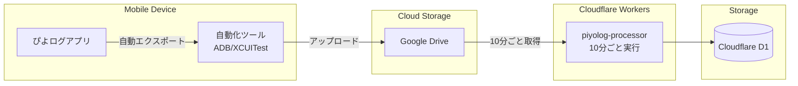

# ぴよログデータ統合仕様（案）

## 概要

ぴよログアプリから育児記録データを自動的にGoogle Driveにエクスポートし、そのデータをCloudflare Workersで処理する統合システム。

## アーキテクチャ概要



## 実装方針

### フェーズ1: 手動エクスポート対応
- ユーザーが手動でぴよログからGoogle Driveにエクスポート
- piyolog-processor Workerが10分ごとにGoogle Driveをチェック
- 新しいデータがあれば取得して処理

### フェーズ2: 自動化検討
- **Android**: ADB (Android Debug Bridge)を使用した自動化
- **iOS**: XCUITestまたは類似ツールを使用した自動化
- デバイス上で定期的にエクスポート操作を自動実行

## データフロー

1. **エクスポート**（詳細は後日検討）
   - ぴよログアプリからCSV/JSONフォーマットでエクスポート
   - Google Driveの指定フォルダにアップロード
   - タイミング：未定（日次を想定）

2. **データ取得**（10分ごと）
   - piyolog-processor WorkerがGoogle Drive APIを使用
   - 新規・更新されたファイルを検出
   - データを取得して処理

3. **データ処理**
   - CSVパース/JSON解析
   - データ正規化
   - D1への保存

## 技術的課題（後日検討）

### 自動化の実装方法
- デバイス制御の安定性
- エラーハンドリング
- セキュリティ（認証情報の管理）

### データ形式
- ぴよログのエクスポート形式の詳細調査
- データマッピング定義
- 重複データの処理方法

## 必要な環境変数

```toml
# workers/piyolog-processor/wrangler.toml
[vars]
GOOGLE_DRIVE_FOLDER_ID = "xxx"  # 監視対象フォルダ

# Secrets
# GOOGLE_SERVICE_ACCOUNT_KEY  # Google Drive API認証用
```

## 注記

この仕様は現在検討段階です。特に自動エクスポート部分（ADB/XCUITest）の実装詳細は、実際のぴよログアプリの動作検証後に確定します。
