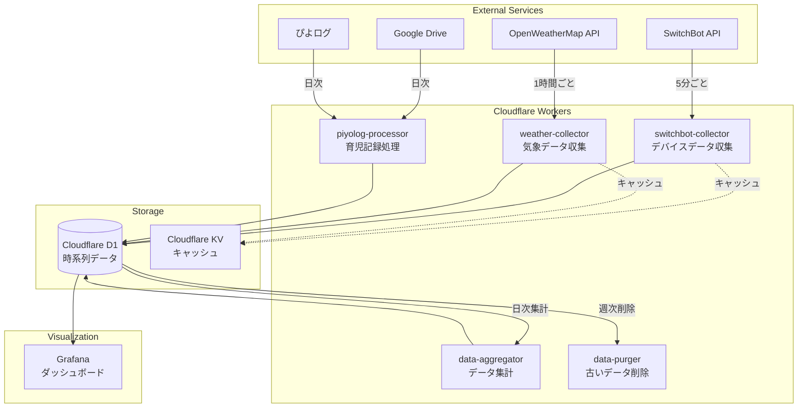

# ファイル構成とコードパターン

## システムアーキテクチャ



## プロジェクト構造

```
childcare-support-dashboard/
├── .kiro/                      # Kiro仕様管理
│   ├── steering/               # ステアリングドキュメント
│   └── specs/                  # 機能仕様
├── workers/                    # Cloudflare Workers（デプロイ単位）
│   ├── weather-collector/      # 気象データ収集Worker
│   │   ├── src/
│   │   │   ├── index.ts       # エントリーポイント
│   │   │   ├── handler.ts     # メインロジック
│   │   │   └── handler.test.ts # 単体テスト
│   │   └── wrangler.toml      # Worker設定
│   ├── switchbot-collector/    # SwitchBotデータ収集Worker
│   │   ├── src/
│   │   │   ├── index.ts
│   │   │   ├── handler.ts
│   │   │   └── handler.test.ts
│   │   └── wrangler.toml
│   ├── piyolog-processor/      # ぴよログ処理Worker
│   │   ├── src/
│   │   └── wrangler.toml
│   ├── data-aggregator/        # データ集計Worker
│   │   ├── src/
│   │   └── wrangler.toml
│   └── data-purger/           # データ削除Worker
│       ├── src/
│       └── wrangler.toml
├── shared/                     # 共有コード
│   ├── api-clients/           # API クライアント
│   │   ├── switchbot.ts
│   │   ├── switchbot.test.ts
│   │   ├── openweather.ts
│   │   └── openweather.test.ts
│   ├── db/                    # データベース関連
│   │   ├── schemas/           # スキーマ定義
│   │   ├── queries.ts         # クエリ関数
│   │   ├── queries.test.ts   # クエリテスト
│   │   └── types.ts          # DB型定義
│   └── types/                 # 共通型定義
├── migrations/                 # D1マイグレーション
│   └── 001_initial.sql
├── scripts/                    # 開発・デプロイスクリプト
│   ├── deploy-all.sh          # 全Worker一括デプロイ
│   └── setup-d1.sh           # D1初期設定
└── deno.json                   # Deno設定
```

## Worker実装パターン

### トランザクションスクリプトパターン

各Workerは単一の責務を持ち、トランザクションスクリプトとして実装します。

```typescript
// workers/weather-collector/src/index.ts
import type { Env } from "./types.ts";
import { collectWeatherData } from "./handler.ts";

export default {
  async scheduled(
    controller: ScheduledController,
    env: Env,
    ctx: ExecutionContext,
  ): Promise<void> {
    // トランザクションスクリプト：一連の処理を実行
    await collectWeatherData(env);
  },
};
```

```typescript
// workers/weather-collector/src/handler.ts
import { createWeatherClient } from "@shared/api-clients/openweather.ts";
import { insertWeatherData } from "@shared/db/queries.ts";
import type { Env } from "./types.ts";

// メインのトランザクションスクリプト
export const collectWeatherData = async (env: Env): Promise<void> => {
  // 1. 外部APIからデータ取得
  const weatherData = await fetchWeatherData(env);

  // 2. データ変換
  const transformed = transformWeatherData(weatherData);

  // 3. データベースに保存
  await saveWeatherData(env.DB, transformed);

  // 4. KVキャッシュ更新（最新データへの高速アクセス用）
  await updateCache(env.KV, transformed);
};

// 各ステップはシンプルな関数として実装
const fetchWeatherData = async (env: Env) => {
  const client = createWeatherClient({
    apiKey: env.OPENWEATHER_API_KEY,
    baseUrl: "https://api.openweathermap.org/data/2.5",
  });

  return await client("/weather", {
    q: env.LOCATION,
    units: "metric",
  });
};

const transformWeatherData = (data: RawWeatherData): WeatherMetric => ({
  timestamp: Date.now(),
  temperature: data.main.temp,
  humidity: data.main.humidity,
  pressure: data.main.pressure,
  locationId: data.id.toString(),
});

const saveWeatherData = async (
  db: D1Database,
  data: WeatherMetric,
): Promise<void> => {
  await insertWeatherData(db, data);
};

// KVキャッシュの利用理由：
// 1. Grafanaダッシュボードからの頻繁なアクセスに対する高速レスポンス
// 2. D1への読み取りクエリ削減によるコスト最適化
// 3. 最新値の即座の取得（リアルタイムモニタリング用）
const updateCache = async (
  kv: KVNamespace,
  data: WeatherMetric,
): Promise<void> => {
  await kv.put(
    `latest:weather:${data.locationId}`,
    JSON.stringify(data),
    { expirationTtl: 3600 }, // 1時間で自動削除
  );
};
```

## コードパターン

### 関数型プログラミング原則

#### シンプルな関数による処理の組み立て

```typescript
// 複雑な処理をシンプルな関数の組み合わせで実現
export const processWeatherData = async (env: Env): Promise<void> => {
  // データ取得
  const rawData = await fetchFromAPI(env.apiKey, env.location);

  // バリデーション
  if (!validateWeatherData(rawData)) {
    throw new Error("Invalid weather data");
  }

  // 変換
  const normalized = normalizeWeatherData(rawData);

  // 保存
  await saveToDatabase(env.DB, normalized);

  // キャッシュ
  await updateCache(env.KV, normalized);
};

// 各処理は独立した関数として定義
const validateWeatherData = (data: unknown): data is RawWeatherData => {
  return (
    typeof data === "object" &&
    data !== null &&
    "main" in data &&
    "id" in data
  );
};

const normalizeWeatherData = (raw: RawWeatherData): WeatherMetric => {
  return {
    timestamp: Date.now(),
    temperature: raw.main.temp,
    humidity: raw.main.humidity,
    locationId: raw.id.toString(),
  };
};
```

#### エラーハンドリング（Result型）
```typescript
// shared/types/result.ts
export type Result<T, E = Error> =
  | { readonly ok: true; readonly value: T }
  | { readonly ok: false; readonly error: E };

export const ok = <T>(value: T): Result<T> => ({
  ok: true,
  value,
});

export const err = <E = Error>(error: E): Result<never, E> => ({
  ok: false,
  error,
});

export const tryCatch = async <T>(
  fn: () => Promise<T>,
): Promise<Result<T>> => {
  try {
    return ok(await fn());
  } catch (error) {
    return err(error as Error);
  }
};
```

### データベースアクセス

#### クエリ関数（トランザクションスクリプト用）
```typescript
// shared/db/queries.ts
import type { WeatherMetric, SensorReading } from "./types.ts";
import { Result, tryCatch } from "@shared/types/result.ts";

// 単一責務のクエリ関数
export const insertWeatherData = (
  db: D1Database,
  data: WeatherMetric,
): Promise<Result<void>> =>
  tryCatch(async () => {
    await db
      .prepare(`
        INSERT INTO weather_metrics (timestamp, metric_type, value, metadata)
        VALUES (?, ?, ?, ?)
      `)
      .bind(
        data.timestamp,
        "temperature",
        data.temperature,
        JSON.stringify({ humidity: data.humidity }),
      )
      .run();
  });

export const getRecentMetrics = (
  db: D1Database,
  hours: number,
): Promise<Result<WeatherMetric[]>> =>
  tryCatch(async () => {
    const cutoff = Date.now() - hours * 60 * 60 * 1000;
    const result = await db
      .prepare(`
        SELECT * FROM weather_metrics
        WHERE timestamp > ?
        ORDER BY timestamp DESC
      `)
      .bind(cutoff)
      .all();

    return result.results.map(parseWeatherMetric);
  });

// データ集計用クエリ
export const aggregateHourlyData = (
  db: D1Database,
  startTime: number,
  endTime: number,
): Promise<Result<AggregatedData[]>> =>
  tryCatch(async () => {
    const result = await db
      .prepare(`
        SELECT
          strftime('%Y-%m-%d %H:00:00', timestamp/1000, 'unixepoch') as hour,
          metric_type,
          AVG(value) as avg_value,
          MIN(value) as min_value,
          MAX(value) as max_value,
          COUNT(*) as count
        FROM weather_metrics
        WHERE timestamp BETWEEN ? AND ?
        GROUP BY hour, metric_type
      `)
      .bind(startTime, endTime)
      .all();

    return result.results.map(parseAggregatedData);
  });

// 古いデータ削除
export const purgeOldData = (
  db: D1Database,
  olderThanDays: number,
): Promise<Result<number>> =>
  tryCatch(async () => {
    const cutoff = Date.now() - olderThanDays * 24 * 60 * 60 * 1000;
    const result = await db
      .prepare("DELETE FROM weather_metrics WHERE timestamp < ?")
      .bind(cutoff)
      .run();

    return result.meta.changes;
  });
```

### Worker間の連携

#### スケジュール設定
```toml
# workers/weather-collector/wrangler.toml
name = "weather-collector"
main = "src/index.ts"
compatibility_date = "2024-01-01"

[triggers]
crons = ["0 * * * *"] # 毎時実行

[[d1_databases]]
binding = "DB"
database_name = "childcare-dashboard"
database_id = "xxx-xxx-xxx"

[[kv_namespaces]]
binding = "KV"
id = "xxx-xxx-xxx"

[vars]
LOCATION = "Tokyo,JP"
```

```toml
# workers/data-aggregator/wrangler.toml
name = "data-aggregator"
main = "src/index.ts"
compatibility_date = "2024-01-01"

[triggers]
crons = ["0 2 * * *"] # 毎日午前2時

[[d1_databases]]
binding = "DB"
database_name = "childcare-dashboard"
database_id = "xxx-xxx-xxx"
```

### 型定義

#### 共有型定義
```typescript
// shared/types/metrics.ts

// 基本メトリック型
export interface BaseMetric {
  readonly timestamp: number;
  readonly locationId: string;
}

// 気象データ
export interface WeatherMetric extends BaseMetric {
  readonly temperature: number;
  readonly humidity: number;
  readonly pressure: number;
}

// センサーデータ
export interface SensorReading extends BaseMetric {
  readonly deviceId: string;
  readonly sensorType: "temperature" | "humidity" | "co2" | "motion";
  readonly value: number;
}

// 集計データ
export interface AggregatedData {
  readonly period: string;
  readonly metricType: string;
  readonly avgValue: number;
  readonly minValue: number;
  readonly maxValue: number;
  readonly count: number;
}
```

#### Worker環境型
```typescript
// workers/weather-collector/src/types.ts
export interface Env {
  readonly DB: D1Database;
  readonly KV: KVNamespace;
  readonly OPENWEATHER_API_KEY: string;
  readonly LOCATION: string;
}
```

### デプロイメント

#### 一括デプロイスクリプト
```bash
#!/bin/bash
# scripts/deploy-all.sh

set -e

echo "Deploying all workers..."

workers=(
  "weather-collector"
  "switchbot-collector"
  "piyolog-processor"
  "data-aggregator"
  "data-purger"
)

for worker in "${workers[@]}"; do
  echo "Deploying $worker..."
  cd "workers/$worker"
  wrangler deploy
  cd ../..
done

echo "All workers deployed successfully!"
```

## テスト戦略

### 単体テスト（プロダクションコードと同じディレクトリに配置）

```typescript
// shared/api-clients/openweather.test.ts
import { assertEquals } from "https://deno.land/std/testing/asserts.ts";
import { transformWeatherData } from "./openweather.ts";

Deno.test("transformWeatherData converts API response correctly", () => {
  const input = {
    main: { temp: 25.5, humidity: 60, pressure: 1013 },
    id: 1850144,
  };

  const result = transformWeatherData(input);

  assertEquals(result.temperature, 25.5);
  assertEquals(result.humidity, 60);
  assertEquals(result.locationId, "1850144");
});
```

```typescript
// workers/weather-collector/src/handler.test.ts
import { assertEquals, assertExists } from "https://deno.land/std/testing/asserts.ts";
import { validateWeatherData, normalizeWeatherData } from "./handler.ts";

Deno.test("validateWeatherData checks required fields", () => {
  const validData = {
    main: { temp: 20, humidity: 50 },
    id: 123,
  };

  assertEquals(validateWeatherData(validData), true);
  assertEquals(validateWeatherData({}), false);
  assertEquals(validateWeatherData(null), false);
});

Deno.test("normalizeWeatherData transforms correctly", () => {
  const raw = {
    main: { temp: 25.5, humidity: 60, pressure: 1013 },
    id: 1850144,
  };

  const result = normalizeWeatherData(raw);

  assertExists(result.timestamp);
  assertEquals(result.temperature, 25.5);
  assertEquals(result.humidity, 60);
  assertEquals(result.locationId, "1850144");
});
```

### テスト実行

```bash
# 全テスト実行
deno test

# 特定のWorkerのテスト
deno test workers/weather-collector/

# カバレッジ付き実行
deno test --coverage=coverage

# カバレッジレポート表示
deno coverage coverage
```
