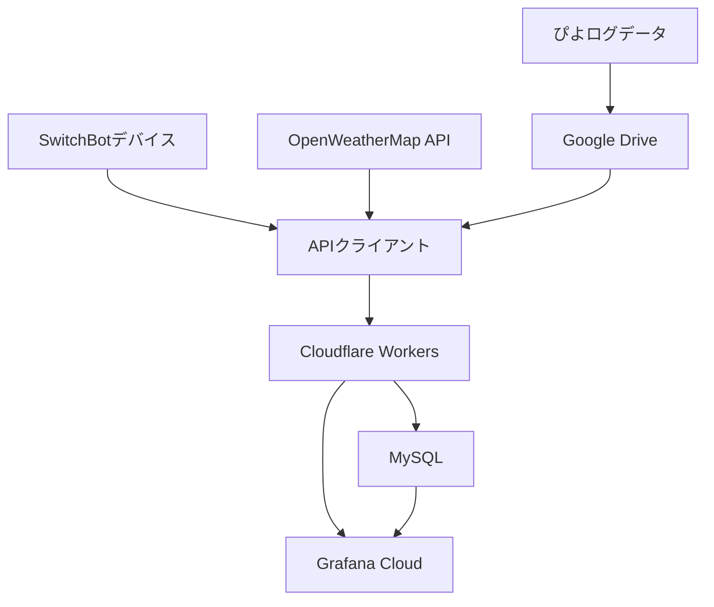

# システムパターン

## アーキテクチャ概要

### システム構成

### コンポーネント構成

1. インフラストラクチャ層
   - Terraform管理リソース
     - Cloudflare Workers
     - MySQL データベース
     - (Grafana Cloud)
       - 可能？
       - 可視化の再現に必要な json をダウンロードするだけでいいかも
   - Infrastructure as Code
     - モジュール化された構成
     - 環境ごとの分離
     - バージョン管理

2. データ収集層
   - SwitchBot APIクライアント（Deno）
   - OpenWeatherMap APIクライアント
   - Google Drive APIクライアント
   - Cloudflare Workers（定期バッチ処理）

3. データストア層
   - さくらのエンハンスドデータベース（MySQL）
   - データレプリケーション
   - バックアップ管理

4. 可視化層
   - Grafana Cloud
   - カスタムダッシュボード
   - アラート設定

## 設計パターン

### APIクライアント（Deno）

- 環境変数による構成管理
- HMAC認証による安全な通信
- エラーハンドリングパターン
- API呼び出しの抽象化

### バッチ処理（Cloudflare Workers）

- 定期実行パターン
- べき等性の確保
- リトライ処理
- エラー通知
- データ同期スケジューリング

### インフラストラクチャ管理

- Terraformによるリソース管理
  - 環境ごとのワークスペース
  - リモート状態管理
  - モジュール化された構成
  - 自動化されたプロビジョニング

### データ永続化（MySQL）

- トランザクション管理
- インデックス最適化
- パーティショニング戦略
- データ型の最適化
- インフラストラクチャのコード化

## データフロー

### 環境・天候データ収集

1. SwitchBotデバイスからのデータ取得
2. OpenWeatherMap APIからの天気データ取得
3. Cloudflare Workersによる定期収集
4. MySQLへのデータ保存
5. Grafanaでの可視化

### 育児記録データ収集

1. ぴよログデータのGoogle Drive監視
2. 新規データの検出と取得
3. データ形式の変換と正規化
4. MySQLへのデータ保存
5. 履歴データの分析と予測
6. Grafanaでの可視化

### データ統合と分析

1. 環境データと天候データの相関分析
2. 育児記録データのトレンド分析
3. 予測モデルの生成
4. アラートルールの評価
5. ダッシュボード更新

## システム連携

### 外部サービス統合

1. SwitchBot API
   - デバイスステータス取得
   - 環境データ収集
   - コマンド実行

2. OpenWeatherMap API
   - 天気データ取得
     - 緯度経度による位置指定
     - デフォルト（東京）設定
     - 言語ローカライズ（日本語）
     - 単位設定（摂氏）
   - 取得可能データ
     - 気温（現在、体感、最高/最低）
     - 湿度、気圧
     - 風速、風向
     - 天気状況
     - 視界、降水量
   - エラーハンドリング
     - API認証エラー検知
     - レスポンス解析
     - エラーメッセージのローカライズ

3. Google Drive API
   - ぴよログデータの監視
   - ファイル変更検知
   - データダウンロード

4. Grafana Cloud
   - リアルタイムモニタリング
   - カスタムダッシュボード
   - アラート通知

5. さくらのエンハンスドデータベース
   - データ永続化
   - バックアップ/リストア
   - レプリケーション

6. Cloudflare Workers
   - スケジュールされたタスク実行
   - データ集計処理
   - エラーハンドリング
